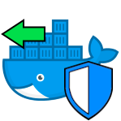

# docker-portmap-server-rootless



[](https://github.com/dmotte/docker-portmap-server-rootless/actions)
[](https://hub.docker.com/r/dmotte/portmap-server-rootless)

This is a :whale: **Docker image** containing an **OpenSSH server** that can be used for **remote port forwarding** only (rootless version). This image is almost equivalent to [dmotte/docker-portmap-server](https://github.com/dmotte/docker-portmap-server) but it runs as a **non-root user**.

Inspired by: https://www.golinuxcloud.com/run-sshd-as-non-root-user-without-sudo/

> :package: This image is also on **Docker Hub** as [`dmotte/portmap-server-rootless`](https://hub.docker.com/r/dmotte/portmap-server-rootless) and runs on **several architectures** (e.g. amd64, arm64, ...). To see the full list of supported platforms, please refer to the [`.github/workflows/main.yml`](.github/workflows/main.yml) file. If you need an architecture that is currently unsupported, feel free to open an issue.

## Usage

> **Note**: this Docker image uses an **unprivileged user** to perform the remote port forwarding stuff. As a result, it will only be possible to use **port numbers > 1024**. However this is not a problem at all, since you can still leverage the **Docker port exposure feature** to bind to any port you want on your host (e.g. `-p "80:8080"`).

The first things you need are **host keys** for the OpenSSH server and an **SSH key pair** for the client to be able to connect. See the usage example of [dmotte/docker-portmap-server](https://github.com/dmotte/docker-portmap-server) for how to get them.

In general, the use of this image is very similar to [dmotte/docker-portmap-server](https://github.com/dmotte/docker-portmap-server), but:

- The **SSH key pairs** go directly into the root of the `/ssh-client-keys` volume instead of subdirectories (because we have only a single regular user inside the container)
- If you want the container to generate missing keys, the related **volume(s) must be writable** by the `portmap` user of the container; otherwise, the generated keys won't be written to the volume(s). For example, to **change the owner** user of the root of an empty volume, you can do something like:

```bash
docker volume create myvol
docker run --rm -v myvol:/v docker.io/library/busybox chown -v 100:101 /v
```

> **Tip**: if you are using **Podman** and a **mounted directory** (bind mount) instead of a volume, this works too:
>
> ```bash
> podman unshare chown -v 100:101 mydir
> ```

In the `PERMIT_LISTEN` **environment variable** you need to specify [which ports can be bound](https://man.openbsd.org/sshd_config#PermitListen), separated by spaces. Example: `8001 8002 8003`

Finally, you can start the server:

```bash
docker run -it --rm \
    -v "$PWD/hostkeys:/ssh-host-keys" \
    -v "$PWD/myclientkey.pub:/ssh-client-keys/myclientkey.pub:ro" \
    -p80:8080 -p2222:2222 \
    -ePERMIT_LISTEN=8080 \
    dmotte/portmap-server-rootless
```

See [dmotte/docker-portmap-server](https://github.com/dmotte/docker-portmap-server) for further details on usage; it's very similar to this one.

For a more complex example, refer to the [`docker-compose.yml`](docker-compose.yml) file.

### Environment variables

List of supported **environment variables**:

| Variable             | Required         | Description                                                      |
| -------------------- | ---------------- | ---------------------------------------------------------------- |
| `KEEPALIVE_INTERVAL` | No (default: 30) | Value for the `ClientAliveInterval` option of the OpenSSH server |
| `PERMIT_LISTEN`      | Yes              | Value for the `PermitListen` option of the OpenSSH server        |

## Development

If you want to contribute to this project, you can use the following one-liner to **rebuild the image** and bring up the **Docker-Compose stack** every time you make a change to the code:

```bash
docker-compose down && docker-compose up --build
```
